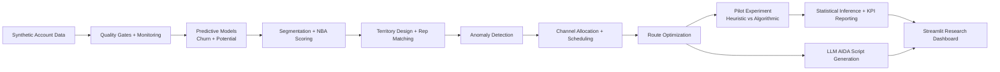

> Research prototype only: this repository is for experimentation and learning, not production deployment.

## Purpose

End-to-end pipeline for sales force optimisation. Sales potential, churn, anomalies, segmentation, Next Best Action and routing

## Security

See [SECURITY.md](./SECURITY.md) for reporting and usage guidance.

# OptimAI: Research-Grade Field Sales Optimisation Pilot

## Author and License

- Author: Javier Castro (dnAI)
- License: MIT (`LICENSE`)

---

OptimAI is a research-grade reference implementation for face-to-face sales force optimisation.

The project is designed to compare two management approaches under controlled experimental conditions:

1. `heuristic` (current-style manual prioritisation)
2. `algorithmic` (model-driven prioritisation + route optimisation)

The objective is to quantify and demonstrate delta on three business KPIs:

1. Sales
2. Efficiency
3. Customer Satisfaction

---

## Current Scope

This codebase is currently configured as **field-only** (no outbound/inbound/ecommerce channels in active decisioning).

- Main pipeline module: `optimai_pipeline.py`
- Interactive app: `streamlit_app.py`
- Automated QA harness: `qa/`
- Automated tests: `tests/`

---

## Models and System Architecture (Comprehensive)

This section describes the implemented architecture in `optimai_pipeline.py` and how the app uses it in `streamlit_app.py`.

### 1. Execution Architecture

- Pipeline entry point: `main(...)`
- Experiment entry point: `run_field_pilot_experiment(...)`
- App entry point: `streamlit run streamlit_app.py`
- Main runtime outputs:
  - `PipelineArtifacts`: scored account table, route optimiser, channel/scheduling summaries, monitoring, execution trace
  - `PilotExperimentArtifacts`: selected reps, strategy route plans, Monte Carlo unit metrics, KPI/statistical summaries



### 2. Data and Validation Layer

- Synthetic data generation: `generate_dummy_customers(...)`
  - Barcelona-like geography (`lat`, `lon`)
  - Commercial, behavioural, risk, and service-quality account signals
  - Deterministic with controlled `random_state`
- Quality gate: `DataValidator`
  - Required columns check
  - Duplicate `client_id` check
  - Numeric NaN policy with configurable allowed columns and max ratio
- Observability:
  - `MonitoringSuite` records model KPIs and process metrics
  - `ExecutionTracer` logs phase-by-phase execution events

### 3. Predictive Modeling Layer

Implemented in `PredictiveModels`:

1. Churn model
   - Algorithm: `GradientBoostingClassifier`
   - Default hyperparameters: `n_estimators=300`, `learning_rate=0.05`, `max_depth=3`
   - Target: `churn_label`
   - Validation metric: ROC AUC (`churn_auc`)
2. Potential model
   - Algorithm: `GradientBoostingRegressor`
   - Default hyperparameters: `n_estimators=500`, `learning_rate=0.05`, `max_depth=3`
   - Target: `future_spend`
   - Validation metric: RMSE (`potential_rmse`)

Shared modeling design:

- Feature scope: numeric columns (excluding target/id leakage columns)
- Missing value treatment: median imputation (`SimpleImputer`)
- Split strategy: holdout validation (`train_test_split`, 80/20)
- Scoring outputs added to account table:
  - `churn_prob`
  - `predicted_potential`

### 4. Decisioning Layer (Segmentation + NBA)

1. Segmentation (`Segmentation.segment`)
   - `monetary_6m` is derived from amount history
   - Quantile bucketing:
     - `value_bucket` from `monetary_6m`
     - `potential_bucket` from `predicted_potential`
   - Final segment key: concatenated bucket code (e.g., `"32"`)
2. Next Best Action (`NextBestAction.score`)
   - z-score normalization (`StandardScaler`) on key drivers
   - Weighted linear NBA score:
     - `segment`: `0.10`
     - `churn_prob`: `0.30`
     - `recency_days`: `0.10`
     - `predicted_potential`: `0.30`
     - `digital_engagement_score`: `0.10`
     - `support_tickets_90d`: `0.10`
   - Output: `nba_score` used throughout ranking and optimization

### 5. Spatial and Operational Optimization Layer

1. Territory design (`TerritoryDesign`)
   - Clustering: `KMeans` on `(lat, lon)` with `n_territories`
   - Rep-territory assignment: Hungarian algorithm (`linear_sum_assignment`) minimizing home-to-centroid distance
2. Anomaly detection (`AnomalyDetection`)
   - Model: `IsolationForest` (default contamination `0.02`)
   - Inputs: `nba_score`, `churn_prob`, `predicted_potential`, `recency_days`
   - Outputs: `anomaly_score`, `is_anomaly`
3. Channel allocation (`ChannelAllocator`)
   - Current project mode is field-only; all recommendations resolve to `field`
   - Confidence/priority logic combines potential, NBA, onsite preference, relationship strength, and inverse digital preference
4. Capacity scheduler (`ContactCenterScheduler`)
   - Capacity-constrained daily selection by channel
   - Schedules top accounts by `nba_score`
   - Outputs backlog and SLA summary fields
5. Route optimizer (`RouteOptimizer`)
   - Daily pool selection: top `daily_visit_quota` by NBA with home-distance tie-break logic
   - Cost model:
     - geographic travel distance (haversine km)
     - minus NBA reward (`nba_lambda_km * normalized_nba`)
   - Time-window aware step simulation (`tw_start`, `tw_end`, service duration)
   - Solver strategy:
     - default forced greedy route construction (`FORCE_GREEDY=True`)
     - decision snapshots available for full per-step auditability

### 6. Experiment Architecture (Baseline vs Treatment)

Implemented in `run_field_pilot_experiment(...)`:

- Rep selection: top reps by account coverage
- Two strategy plans per rep:
  - `heuristic`: distance/recency/touch-weighted priority + nearest-next traversal
  - `algorithmic`: NBA-reward route optimizer
- Monte Carlo simulation (`n_runs x n_days x n_reps x 2 strategies`) produces paired rep-day units
- Simulated outcomes:
  - `sales_eur`
  - `sales_per_hour_eur`
  - `avg_post_visit_csat`
  - plus route and operational metrics

Statistical inference stack on paired strategy deltas:

- Bootstrap CI for mean delta
- Paired permutation test
- Paired t-test
- Wilcoxon signed-rank
- Sign test
- Effect size (Cohen's d)
- FDR correction (Benjamini-Hochberg) across KPI family

### 7. LLM Script-Generation Layer

Implemented in `generate_pilot_aida_scripts(...)`:

- Trigger scope: selected pilot visits (typically algorithmic route plan)
- Context assembly includes account profile + model signals + route position
- Engagement mode classifier:
  - `recovery_then_sales`
  - `pure_sales_industry`
  - `consultative_growth`
- OpenAI call path: `POST /v1/chat/completions` (default model `gpt-4o-mini`)
- Output contract:
  - strict AIDA sections (`Attention`, `Interest`, `Desire`, `Action`)
  - compliance line
  - no internal metric names or raw model score exposure in final script

### 8. Streamlit Application Architecture

`streamlit_app.py` is a thin orchestration/presentation layer:

- Collects pipeline, pilot, and inference parameters from sidebar controls
- Executes `main(...)` and `run_field_pilot_experiment(...)`
- Stores artifacts in `st.session_state`
- Renders:
  - KPI impact cards and inference table
  - per-rep delta analytics
  - route comparison table/map
  - notebook-style diagnostics for each pipeline stage
  - optional LLM AIDA generation workflow

---

## End-to-End Pipeline

The orchestrator entry point is `main(...)` in `optimai_pipeline.py`.

High-level flow:

1. Synthetic account generation (Barcelona-like geography + best-practice sales signals)
2. Data quality validation gates
3. Predictive model training and scoring
   - Churn model (Gradient Boosting Classifier)
   - Potential model (Gradient Boosting Regressor)
4. Segmentation and NBA scoring
5. Territory clustering and rep assignment
6. Anomaly detection (Isolation Forest)
7. Field channel assignment and prep script generation
8. Capacity-aware scheduling summaries
9. Route optimisation artifacts

Pipeline return object: `PipelineArtifacts`

- `df`: account-level scored dataset
- `router`: route optimizer instance
- `contact_center_schedule`: compatibility schedule table (field-only context)
- `channel_summary`, `channel_tracking`: capacity and allocation summaries
- `monitoring`: KPI and monitoring records
- `execution_trace`: phase-by-phase run trace
- `validator_issues`: quality gate issues

---

## Research-Grade Pilot Experiment

Pilot experiment entry point: `run_field_pilot_experiment(...)` in `optimai_pipeline.py`.

It returns `PilotExperimentArtifacts`:

- `selected_reps`: selected pilot salespersons (default 2)
- `route_plan`: stop-by-stop plan for heuristic and algorithmic strategies
- `unit_metrics`: paired rep-day simulation units
- `kpi_summary`: before/after KPI aggregates
- `stats_summary`: inference outputs

### Baseline vs Treatment

- `heuristic`: distance/recency/touch-based prioritisation with nearest-next routing
- `algorithmic`: NBA-aware optimiser using reward-adjusted travel costs

### KPI Inference Stack

For `sales`, `efficiency`, and `customer_satisfaction`, the system computes:

- Paired deltas (`algorithmic - heuristic`)
- Bootstrap confidence intervals
- Paired permutation p-values
- Paired t-test p-values
- Wilcoxon p-values
- Sign-test p-values
- Cohen's d effect size
- FDR-adjusted q-values across KPI family

---

## Synthetic Data Used (Current)

The project currently uses a synthetic but structured account dataset from `generate_dummy_customers(...)` in `optimai_pipeline.py`.

It includes:

- Geography: Barcelona-like spatial distribution (`lat`, `lon`)
- Commercial core: `amount`, `future_spend`, `lifetime_value`, `churn_label`
- Sales qualification signals:
  - `budget_fit_score`
  - `authority_access_score`
  - `need_intensity_score`
  - `timeline_urgency_score`
- Relationship and value signals:
  - `relationship_strength`
  - `value_realization_score`
  - `meeting_accept_rate`
- Risk and complexity signals:
  - `competitor_pressure_index`
  - `implementation_risk_score`
  - `account_complexity_index`
  - `buying_committee_size`
  - `decision_cycle_days`
- Experience signals:
  - `csat_score`
  - `nps_score`
  - `support_tickets_90d`

This data is deterministic per random seed and suitable for controlled algorithm benchmarking.

---

## Heuristic Data Ingestion (Current Status)

At present, heuristic comparison is **simulated** from the same synthetic account universe.

No external heuristic history file is yet wired into the pipeline.

If you want production-like comparison, ingest these datasets:

1. `accounts.csv`
2. `heuristic_visits.csv`

Recommended minimum schema for `heuristic_visits.csv`:

- `date`
- `rep_id`
- `client_id`
- `stop_order`
- `travel_km` (or geocoordinates to derive)
- `sales_eur`
- `service_hours`
- `post_visit_csat`

This allows true pre/post evaluation against historical heuristic execution rather than simulated baseline.

---

## Visualisation Coverage

The Streamlit app includes both research KPI analytics and notebook-style algorithm diagnostics.

Included visuals:

- KPI delta cards (with CI/p-value/q-value context)
- Per-rep before/after delta table
- Distribution diagnostics for sales/efficiency/CSAT deltas
- Route distance comparison by strategy
- Route comparison map (algorithmic vs heuristic)
- Notebook visual suite tabs:
  - Segmentation
  - Territories
  - Churn ROC
  - NBA distribution
  - Anomaly score scatter
  - Anomaly geospatial map
  - Route execution view
- Routing decision audit table per step (candidate ranking/feasibility)

---

## LLM AIDA Visit Scripts

The app can generate **LLM-powered AIDA scripts** for pilot visits.

How it works:

- Scope: only pilot reps and selected pilot visits
- Strategy source: algorithmic route plan by default
- Inputs per visit:
  - customer profile context
  - NBA score and related risk/potential signals
- Output:
  - structured AIDA script (`Attention`, `Interest`, `Desire`, `Action`)
  - compliance reminder line
  - context-aware engagement mode:
    - `recovery_then_sales`: adds a **Resolution Bridge (Before AIDA)** to address dissatisfaction/risk and then transitions into sales
    - `pure_sales_industry`: direct sales script for strong accounts with high upside, using industry-native language
    - `consultative_growth`: balanced discovery + value expansion script

Generation constraints:

- Scripts must convert model context into customer-facing language.
- Scripts must not reference internal metric names (`CSAT`, `churn`, `NBA`, etc.) or raw model scores.
- Recovery context must be handled before AIDA when dissatisfaction/risk signals are present.

API key resolution in code:

1. `OPENAI_API_KEY` from environment
2. `OPENAI_API_KEY` from project `.env`
3. `OPENAI_API_KEY` from `/Users/macjcp/.env`
4. `OPENAI_API_KEY_MACJCP` from environment
5. `~/.openai_api_key`
6. `~/.config/openai/api_key`

In the app:

1. Run the pilot.
2. Go to **LLM AIDA Scripts for Pilot Visits**.
3. Choose model (default `gpt-4o-mini`) and visits per rep.
4. Click **Generate AIDA Scripts (Pilot Reps)**.

---

## Run the App

```bash
python3 -m pip install -U \
  streamlit pandas numpy scipy scikit-learn matplotlib folium shapely

streamlit run streamlit_app.py
```

Open the URL printed by Streamlit (usually `http://localhost:8501`).

---

## Programmatic Usage

```python
from optimai_pipeline import (
    Config,
    generate_pilot_aida_scripts,
    main,
    run_field_pilot_experiment,
)

cfg = Config(
    n_territories=20,
    daily_visit_quota=10,
    pilot_salespersons=2,
    pilot_days=40,
    monte_carlo_runs=300,
)

artifacts = main(cfg=cfg, n_customers=3600, show_initial_visuals=False)
pilot = run_field_pilot_experiment(artifacts=artifacts, cfg=cfg)

# Requires OPENAI_API_KEY via env/.env (project .env or /Users/macjcp/.env).
scripts = generate_pilot_aida_scripts(
    artifacts=artifacts,
    pilot=pilot,
    strategy="algorithmic",
    model="gpt-4o-mini",
    max_visits_per_rep=5,
)

print(pilot.kpi_summary)
print(pilot.stats_summary)
print(scripts[["rep_id", "stop", "client_id", "aida_script"]].head())
```

---

## Configuration Highlights

Main configurable parameters in `Config` include:

- `n_territories`
- `daily_visit_quota`
- `nba_lambda_km`
- `pilot_salespersons`
- `pilot_days`
- `monte_carlo_runs`
- `bootstrap_iterations`
- `permutation_iterations`
- `random_state`

Field-only behavior is enforced via:

- `channels=("field",)`

---

## Research-Grade QA

Protocol: `qa/QA_PROTOCOL.md`

One-command QA:

```bash
bash qa/run_research_grade_qa.sh
```

This executes:

1. Compile checks for `optimai_pipeline.py` and `streamlit_app.py`
2. Full pytest suite (pipeline + reproducibility + streamlit smoke)

Artifacts generated:

- `qa/last_qa_run.log`
- `qa/pytest-report.xml`

---

## Reproducibility

- Set `random_state` in `Config` for deterministic synthetic generation and experiment runs.
- QA mode for Streamlit smoke testing can be enabled with:

```bash
OPTIMAI_QA_FAST=1
```

This lowers default app workload for faster automated execution.

---

## Repository Layout

- `optimai_pipeline.py`: core pipeline + experiment engine
- `streamlit_app.py`: interactive pilot dashboard
- `tests/`: automated pipeline and app tests
- `qa/`: QA protocol, runner script, reports
- `Sales Force Optimisation M.ipynb`: original notebook source
- `route_map.html`: sample map artifact

---

## Limitations and Next Steps

Current limitations:

- Heuristic baseline uses synthetic simulation, not external historical logs.
- No built-in connector yet for CRM/field-force systems.

Recommended next steps:

1. Implement real heuristic data ingestion and schema validation.
2. Add closed-loop post-pilot outcome ingestion.
3. Add rep-level stratified randomisation constraints for live pilots.
4. Add CI workflow to run QA script on every pull request.
